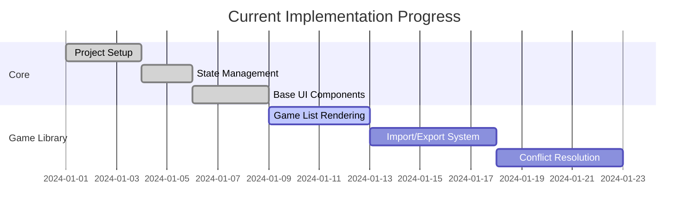

# RevGames Rewrite Development Plan

## Phase 1: Core Infrastructure
✅ **Completed**
- [x] Project setup with Vite + React + TypeScript
- [x] Base styling architecture
- [x] Zustand state management
- [x] Game type definitions
- [x] Tabbed interface structure

## Phase 2: Game Library Features
**Current Phase**
1. **Game Item Components**
   - [x] Basic GameItem component
   - [ ] Game preview modal
   - [ ] Delete confirmation dialog
   - [ ] Edit game metadata

2. **Local Storage Integration**
   - [ ] Game persistence
   - [ ] Version migration
   - [ ] Backup/restore

3. **Import/Export System**
   - [ ] CSV parser service
   - [ ] File upload component
   - [ ] Conflict resolution UI
   - [ ] Export functionality

## Phase 3: Game Creation
1. **Category Game Editor**
   - [ ] Drag-n-drop categories
   - [ ] Answer management
   - [ ] Preview mode

2. **SBA Game Editor**
   - [ ] Question bank management
   - [ ] Answer key validation
   - [ ] Bulk import

## Phase 4: Gameplay Engine
1. **Core Mechanics**
   - [ ] Drag-n-drop implementation
   - [ ] Scoring system
   - [ ] Timer component

2. **Game Modes**
   - [ ] Categories mode
   - [ ] Multiple choice (SBA)
   - [ ] Mixed mode

## Phase 5: Quality Assurance
1. **Testing**
   - [ ] Unit tests (Jest)
   - [ ] E2E tests (Playwright)
   - [ ] Performance audits

2. **Optimization**
   - [ ] Lazy loading
   - [ ] State serialization
   - [ ] Bundle analysis

## Phase 6: Deployment
1. **Production Build**
   - [ ] PWA configuration
   - [ ] Analytics integration
   - [ ] Error monitoring

2. **Documentation**
   - [ ] User guide
   - [ ] Developer docs
   - [ ] Migration guide

## Current Implementation Checklist
