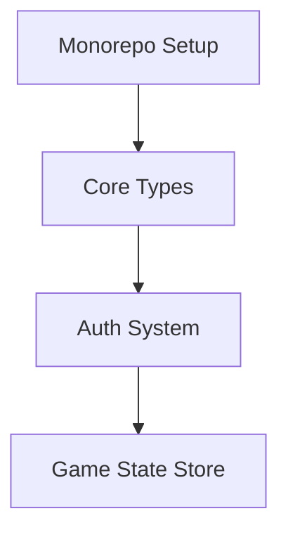

# RevGames Rewrite Plan

## Technical Strategy

### 1. Core Requirements
- **Key Features to Maintain:**
  - Game creation with categories/answers (src/js/modules/gameCreation.js)
  - Drag-n-drop gameplay (src/js/modules/dragAndDrop.js)
  - CSV import/export with conflict resolution (src/js/modules/importConflictResolver.js)
  - Multiple game modes (Categories/Multiple Choice)
- **New Feature**: SBA Game Support
- **Key Additions**:
  - Tabbed game library (Categories/SBA)
  - SBA-specific CSV parser (src/js/modules/sbaParser.ts)
  - Shared import pipeline with conflict resolution

### 2. Modern Tech Stack
javascript
// Core
const stack = {
framework: "React + TypeScript + Vite",
state: "Zustand/Jotai",
ui: "Radix Primitives + Headless UI",
dragDrop: "Dnd Kit",
testing: "Jest + React Testing Library + Playwright"
};

### 3. Architecture Layers
1. **Presentation Layer**  
   - Components for Game Library/Editor/Play
   - Adaptive theming system
   - **New tabbed interface**
     ```typescript
     <Tabs.Root defaultValue="categories">
       <Tabs.List>
         <Tabs.Trigger value="categories">Category Games</Tabs.Trigger>
         <Tabs.Trigger value="sba">SBA Games</Tabs.Trigger>
       </Tabs.List>
       <Tabs.Content value="categories">...</Tabs.Content>
       <Tabs.Content value="sba">...</Tabs.Content>
     </Tabs.Root>
     ```

2. **State Management**  
   ```typescript
   interface GameState {
     library: Game[];
     currentGame: Game | null;
     importConflicts: ConflictGroup[];
     sbaGames: SBAGame[];
   }
   ```

3. **Core Logic**  
   - Migrate validation from `gamePlayMainUtilities.js`
   - Port conflict resolution logic (lines 454-710 of importConflictResolver.js)
   - **SBA CSV Parser (src/js/modules/sbaParser.ts)**
     ```typescript
     export function parseSBACSV(csvData: string): SBAGame {
       return Papa.parse(csvData, {
         header: false,
         transform: (value) => value.replace(/^"|"$/g, ''),
         complete: (results) => processSBARows(results.data)
       });
     }
     ```

### 4. OSS Integration Plan
| Module              | OSS Solution       | Benefit                          |
|---------------------|--------------------|----------------------------------|
| CSV Parsing         | Papaparse          | Better error handling            |
| Drag-n-drop         | Dnd Kit            | Accessibility improvements       |
| State Machines      | XState             | Complex gameplay flows           |
| Analytics           | Plausible          | Privacy-focused tracking         |
| Tab Interface       | Radix Tabs         | Accessible tab components        |
| Table Display       | TanStack Table     | SBA preview table                |

## Implementation Roadmap

### Phase 1: Foundation



### Phase 2: Key Module Migration
1. **Conflict Resolver**  
   - Port group resolution logic from `conflictGroup.js`
   - Implement with TanStack Table

2. **Gameplay Engine**  
   ```typescript
   class GameEngine {
     private score: number = 0;
     
     constructor(private gameMode: GameMode) {}
     
     validateAnswer(answer: Answer): boolean {
       // Port logic from gamePlayCategories.js
     }
   }
   ```

3. **SBA Game Support**:
   - Create `SBAGame` type
   - Add tab navigation to game library
   - Port CSV parsing from `importExport.js` with SBA adaptations

4. **Conflict Resolver**:
   ```typescript
   function detectSBACsvConflicts(existing: SBAGame, imported: SBAGame) {
     // Compare question banks and answer keys
   }
   ```

### Phase 3: QA & Launch
- **Testing:** 100% coverage for conflict resolver
- **Performance:** <100ms game load time
- **Accessibility:** WCAG 2.1 AA compliance
- **Testing**: Verify SBA CSV imports with @Book1.csv format
- **Performance**: <500ms SBA game load time

## Full PRD & Code References
See original plan details in:  
`importConflictResolver.js:454-710` (conflict resolution)  
`gamePlayMainUtilities.js:1-116` (core game logic)